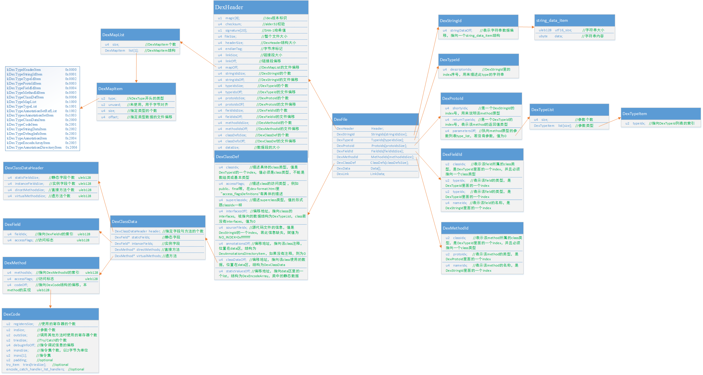
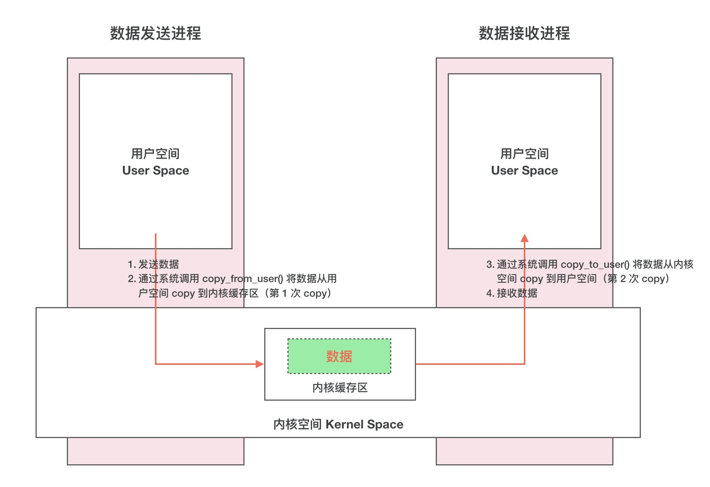
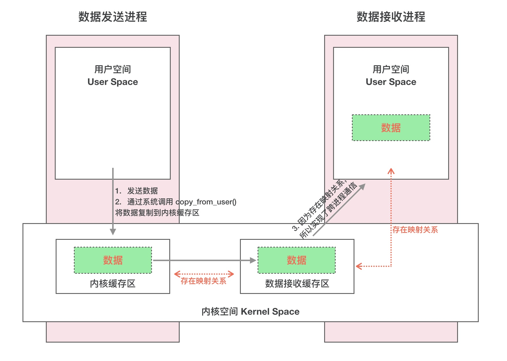

# 一些整理

## aaa

### 类加载器

1. appclassloader
2. extclassloader
3. bootstrapclassloader (c语言)

### 双亲委派

- 在加载一个字节码文件时，会询问当前的classLoader是否已经加载过此字节码文件。如果加载过，则直接返回，不再重复加载。如果没有加载过，则会询问它的Parent是否已经加载过此字节码文件，同样的，如果已经加载过，就直接返回parent加载过的字节码文件，而如果整个继承线路上的classLoader都没有加载过，才由child类加载器（即，当前的子classLoader）执行类的加载工作。

- 特点：  
如果一个类被classLoader继承线路上的任意一个加载过，那么在以后整个系统的生命周期中，这个类都不会再被加载，大大提高了类的加载效率。

- 作用：

1. 类加载的共享功能  
一些Framework层级的类一旦被顶层classLoader加载过，会缓存到内存中，以后在任何地方用到，都不会去重新加载。
2. 类加载的隔离功能  
共同继承线程上的classLoader加载的类，肯定不是同一个类，这样可以避免某些开发者自己去写一些代码冒充核心类库，来访问核心类库中可见的成员变量。如java.lang.String在应用程序启动前就已经被系统加载好了，如果在一个应用中能够简单的用自定义的String类把系统中的String类替换掉的话，会有严重的安全问题。

- 验证多个类是同一个类的成立条件：  

1. 相同的className
2. 相同的packageName
3. 被相同的classLoader加载

### dex文件保护

    一代：
        对dex保护，生成包过程中加密，自定义类加载器解密dex。
        hook类加载器来脱壳。
    二代：
        类级别dex保护，dex中抽取核心函数，利用dalvik虚拟机的类加载机制。
        执行中调用classinit，调用修复函数。
    三代：
        以上内存中运行的是标准指令。
        抽离核心函数，翻译成自定义指令。
        内存中不是标准指令，通过自己的解释器得到真正的功能。
    四代：
        核心函数使用c来写，编译成so。
        so保护机制完善，vmp等。

### *ARM函数调用指令变化

    在main函数中，使用IP(R12)暂时保存栈指针sp,
    然后使用堆栈操作指令stmfd将栈帧(FP). IP. 程序返回地址(LR). 程序计数器（PC）压栈，以保护现场，
    然后使用sub fp,ip,#4使fp指向当前函数栈帧的栈底，sub sp,sp,#8，为当前函数局部变量分配空间。
    接下来通过寄存器传递参数r0,r1,r2,r3。使用BL指令调用函数，
    BL指令同时也会将当前指令的下一条指令地址赋给LR,以跳转回来。最后使用ldmfd恢复现场。

### ARM SPARC

- 关于函数的调用和返回

1. ARM  
ARM跳转有BL指令，Branch Link（Saves (PC+4) in LR and jumps to function），即首先将跳转指令的下一条指令地址保存在LR寄存器中，以便调用函数返回时能找到返回地址，然后执行跳转。  
如果是non-leaf函数，在调用函数起始，则会将LR和r11=fp都压入堆栈，在结束时，则弹出给PC和r11；  
如果是leaf函数，在调用函数起始，则只会将r11=fp压入堆栈，在结束时，则弹出给r11，同时跳转到LR，bx lr。  
2. Sparc  
对于Sparc处理器，在执行call label时，会将PC拷贝到o7（r15，address of call instruction），call指令本身叫call and link，其中link与ARM中BL的link是一个意思，即保存一个调用函数的链接。不同的是ARM保存的是跳转指令的下一条指令地址，Sparc保存的是跳转指令地址，这没关系，对于Sparc来说，只需在返回的时候+4即可得到下一条要执行的地址，即返回的地址。  
在调用函数起始，如果是非叶子函数，会执行save，旋转寄存器窗口，该动作相当于将o7=LR保存起来，同时，上一窗口的sp保存在当前窗口的fp中。如果是叶子函数，则不会旋转寄存器窗口。  
在调用函数结束，返回是ret和retl（retl中l为leaf的意思）。注意到call的时候将PC放在了o7中，所以，返回时，只需要跳转到o7+8即可。  
而对于leaf和non-leaf又有点差别，对于leaf函数，没有执行save，没有寄存器旋转，因此，retl指令jmpl的目标地址为o7+8；  
而对于non-leaf函数，执行了save，有寄存器旋转，之前的o7变为现在的i7，因此ret指令jmpl的目标地址为i7+8。  
同时，对于sparc来说，在non-leaf中还会restore，将寄存器旋转回来；在leaf中则没有restore。  

- 关于函数调用时的frame pointer，fp保存  

    对于ARM，r11为fp。在调用callee函数中，会  
    （1）将fp和lr压入堆栈push {r11, lr}，  
    （2）让fp=sp，add r11, sp, #0，  
    （3）sp减去栈帧长度，sub sp, sp, #16。  
    对于Sparc，fp=i6，sp=o6。在调用callee函数中，执行save %sp, -1024, %sp时，寄存器窗口会旋转，从而做了  
    （1）将fp和lr压入堆栈（当前未使用的寄存器窗口发挥了部分堆栈的作用），  
    （2）让fp=sp（fp=i6，sp=o6，以及寄存器窗口旋转方向，完成了fp=sp操作），  
    （3）sp减去栈帧长度（save有add的作用）。  

- 总结一下函数调用和返回  

    调用时，要保存返回地址，arm用BL保存在LR，sparc用call保存在o7。  
    调用函数的起始：要保存返回地址和栈帧（通过保存fp），同时更新栈帧。arm将r11，fp压入堆栈，sub sp；sparc用save旋转寄存器将o7和fp保存起来，同时sub sp。  
    调用函数的结束：跳转到返回地址，同时恢复栈帧。arm令sp=r11，出栈r11和LR到r11和pc；sparc用ret返回（jmpl o7+8），同时用restore旋转寄存器恢复sp=fp。  

## DEX文件结构

## Binder机制

### 为什么用Binder

1. 性能方面，socket/管道/消息队列需要两次拷贝，共享内存无需拷贝但是控制复杂，Binder只需要一次拷贝。
2. 稳定性，基于C/S架构，架构清晰，职责明确又相互独立，稳定性好。
3. 安全性，传统IPC无法获得对方可靠的进程ID，无法鉴别对方身份，Binder获取进程UID

### 为什么不是同一个进程

1. 反射机制，互相调用，不安全
2. 主线程，后台线程卡顿

### Linux传统IPC

通常的做法是消息发送方将要发送的数据存放在内存缓存区中，通过系统调用进入内核态。然后内核程序在内核空间分配内存，开辟一块内核缓存区，调用 copyfromuser() 函数将数据从用户空间的内存缓存区拷贝到内核空间的内核缓存区中。同样的，接收方进程在接收数据时在自己的用户空间开辟一块内存缓存区，然后内核程序调用 copytouser() 函数将数据从内核缓存区拷贝到接收进程的内存缓存区。这样数据发送方进程和数据接收方进程就完成了一次数据传输，我们称完成了一次进程间通信。

  

### Binder原理

- 动态内核可加载模块
  
1. 管道. socket是内核的一部分，Binder并非内核的一部分。
2. Binder驱动 通过LKM运行时链接到内核，作为内核的一部分运行，负责各进程通过Binder实现通信。

- 内存映射

1. mmap()内存映射，将用户控件的一块内存区域映射到内核空间，然后对该区域的修改将直接反映到内核空间，反之同理。
2. 减少了拷贝次数

- 完整Binder IPC通信过程

1. Binder驱动在内核空间创建一个数据接收缓存区；
2. 在内核空间开辟一块内核缓存区，建立**内核缓存区**和**内核中数据接收缓存区**之间的映射关系，以及**内核中数据接收缓存区**和**接收进程用户空间**地址的映射关系；
3. 通过系统调用copyfromuser()将数据copy到内核中的内核缓存区，由于**内核缓存区**和**接收进程的用户空间**存在内存映射，因此也就相当于把数据发送到了接收进程的用户空间，这样便完成了一次进程间的通信。

### 一些ARM指令

1. BL：branch with link 存储下一条指令地址到LR(r14)，并跳转
2. STMFD：寄存器数据压栈 STMFD SP! (R11,LR);
3. LDMFD：从栈恢复寄存器数据 

### SELinux

0. 背景：原来的安全模型是DAC 自主访问控制。进程理论上所拥有的权限与执行它的用户的权限相同
1. 是Linux内核的一个强制访问控制机制
2. 默认拒绝原则，未经明确允许都会被拒绝
3. 宽容模式：权限拒绝事件会被记录，但不会被执行
4. 强制模式：记录并拒绝
5. MAC基于三个主要概念：主体，对象和操作
6. 主体对对象的操作符合规则才能实现
7. 安全上下文 用户:角色:域

## SEAndroid

### 用户空间

- 在用户空间，SEAndorid 主要包含三个模块，分别是安全上下文（Security Context）. 安全策略（SEAndroid Policy）和安全服务（Security Server）。

（1）安全上下文
SEAndroid 是一种基于安全策略的 MAC 安全机制。这种安全策略又是建立在对象的安全上下文的基础上的，SEAndroid 中的对象分为主体（Subject）和客体（Object），主体通常是指进程，而客体是指进程所要访问的资源，如文件. 系统属性等

安全上下文实际上就是一个附加在对象上的标签（Tag）。这个标签实际上就是一个字符串，它由四部分内容组成，分别是 **SELinux 用户. SELinux 角色. 类型. 安全级别**，每一个部分都通过一个冒号来分隔，格式为 “user:role:type:sensitivity”

2）安全策略
SEAndroid 安全机制中的安全策略是在安全上下文的基础上进行描述的，也就是说，它通过主体和客体的安全上下文，定义主体是否有权限访问客体。

Type Enforcement
SEAndroid 安全机制主要是使用对象安全上下文中的类型来定义安全策略，这种安全策略就称 Type Enforcement，简称TE。在 system/sepolicy 目录和其他所有客制化 te 目录（通常在 device//common，用 BOARD_SEPOLICY_DIRS 添加），所有以 .te 为后缀的文件经过编译之后，就会生成一个 sepolicy 文件。这个 sepolicy 文件会打包在ROM中，并且保存在设备上的根目录下。

一个 Type 所具有的权限是通过allow语句来描述的

`allow unconfineddomain domain:binder { call transfer set_context_mgr };`

表明 domain 为 unconfineddomain 的进程可以与其它进程进行 binder ipc 通信（call），并且能够向这些进程传递 Binder 对象（transfer），以及将自己设置为 Binder 上下文管理器（set_context_mgr）。

（3）Security Server
Security Server 是一个比较笼统的概念，主要是用来保护用户空间资源的，以及用来操作内核空间对象的安全上下文的，它由应用程序安装服务 PackageManagerService. 应用程序安装守护进程 installd. 应用程序进程孵化器 Zygote 进程以及 init 进程组成。其中，PackageManagerService 和 installd 负责创建 App 数据目录的安全上下文，Zygote 进程负责创建 App 进程的安全上下文，而 init 进程负责控制系统属性的安全访问。

## Hook

### 反射机制

反射是指计算机程序在运行时（Run time）可以访问. 检测和修改它本身状态或行为的一种能力。用比喻来说，那种程序能够“观察”并且修改自己的行为.

在面向对象的编程语言如Java中，反射允许在编译期间不知道接口(类)的名称，字段. 方法的情况下在运行时检查类. 接口. 字段和方法。这种动态获取信息以及动态调用对象方法的功能称为java语言的反射机制.

对象是表示或封装一些数据，**一个类被加载后，jvm会在方法区创建一个对应该类的Class对象**，类的整个结构信息会放到对应的Class对象中。**这个Class对象就想一面镜子一样，通过这面镜子我们可以看到对应类的全部信息**.通过Class对象,我们可以创建Constructor, Field, Method对象.

### Android ClassLoader

#### PathClassLoader

    public class PathClassLoader extends BaseDexClassLoader {

        public PathClassLoader(String dexPath, ClassLoader parent) {
            super(dexPath, null, null, parent);
        }

        public PathClassLoader(String dexPath, String libraryPath,
                ClassLoader parent) {
            super(dexPath, null, libraryPath, parent);
        }
    }
PathClassLoader比较简单, 继承于BaseDexClassLoader. 封装了一下构造函数, 默认 optimizedDirectory=null.**加载已经安装到系统中的Apk的class字节码文件（类似java的App ClassLoader）**

#### DexClassLoader

    public class DexClassLoader extends BaseDexClassLoader {

        public DexClassLoader(String dexPath, String optimizedDirectory, String libraryPath, ClassLoader parent) {
            super(dexPath, new File(optimizedDirectory), libraryPath, parent);
        }
    }
DexClassLoader也同样,只是简单地封装了BaseDexClassLoader对象,并没有覆写父类的任何方法.**加载制定目录的class字节码文件（类似java中的Custom ClassLoader）**

#### BaseDexClassLoader

    public class BaseDexClassLoader extends ClassLoader {
        private final DexPathList pathList;  //记录dex文件路径信息

        public BaseDexClassLoader(String dexPath, File optimizedDirectory, String libraryPath, ClassLoader parent) {
            super(parent);
            this.pathList = new DexPathList(this, dexPath, libraryPath, optimizedDirectory);
        }
    }

BaseDexClassLoader构造函数, 有一个非常重要的过程, 那就是初始化DexPathList对象.**PathClassLoader和DexClassLoader的父类**

#### ClassLoader

## JAVA

### jvm

可见性，值被某一个修改，其他线程立即更新
所有变量在主内存（共享内存），读写必须在工作内存中进行，不直接修改主内存。
volatile 保证可见性，不保证原子性。

## 安全SDK方向

### webview

1. webview使用file协议时，只允许加载本地私有目录：/andorid_asset和android_res这两个目录下的html文件；
2. 安全webview对于可以使用的JS交互接口的**url**进行限制；
3. 在Java中注册handler，供js调用。

### BinderSecurity

1. Binder通信接口校验签名（云端. 本地）。

### upgradeTool

1. 升级信息等：描述. url. 强制安装. 版本号. 开发版本号. md5. 签名后md5；
2. 安装：获取开发版本，比对升级；获取错误信息

### safeZip

1. 读取APK等文件的安全性，确保不含有'../'，只有一个dex（恶意代码执行），签名一致

### intent uri安全策略阻拦

1. 白名单

### jar签名

### Android攻击面

#### 远程攻击面

1. 协议栈，http等

## 注入

### 注入框架

### so注入

1. 调用ptrace_attach()附加进程
2. 调用ptrace_getregs()获取目标进程的寄存器信息，并将他们保存起来。在注入过程中，它们的值会被修改。注入后，需要将他们恢复为原始值
3. 获取目标进程mmap()函数的地址，并调用它为so文件分配内存空间。
4. 调用ptrace_writedata()，将so文件的内容写入目标进程。
5. 获取目标进程dlopen()与dlsym()等函数的地址。
6. 调用ptrace_writedata()，将需要执行的函数的参数信息写入目标进程。
7. 调用dlopen()与dlsym()获取需要执行的函数在so文件中加载的地址。
8. 调用ptrace_setregs()恢复进程的寄存器信息。
9. 调用ptrace_detach()取消对目标进程的附加。

### dex注入

1. 编写Java代码，并将其编译成DEX或APK文件。这个阶段的开发工作由Android Studio完成。
2. 编写Native代码，定义so加载后需要执行的函数（它的内容必须包含加载DEX的代码），将其编译成so文件。这个阶段的开发工作使用Android Studio和Android NDK完成。
3. 编写注入程序，实现远程进程注入。同so注入。
4. 将so文件注入到目标进程。
5. 运行so文件中的指定函数。

### JNI注册

#### 静态注册

此注册方法是初学者经常用到的, 比较常见, 这里简单说下流程,

1. 编写一个java类，在里面加载对应的so库并且通过native关键字定义需要调用的函数

        package com.example.wenzhe.myjni;
        /**
        * Created by wenzhe on 16-1-27.
        */
        public class JniTest {
        public native int getRandomNum();
        public native String getNativeString();

        static {
            System.loadLibrary("HelloJni");
            }
        }

2. 在命令行下输入 javac JniTest.java 生成JniTest.class文件
然后在src目录下通过 javah com.example.wenzhe.myjni.JniTest 生成 com_example_wenzhe_myjni_JniTest.h 头文件
3. 将头文件拷贝到jni目录下(eclipse在src同级目录建立文件夹，Android studio 在java同级目录建立文件夹)
4. 编写C/C++源代码 并把刚拷贝的头文件包含进去 ,复制头文件中函数的定义部分，并实现其中的你想要的功能  

5. 然后编写Android.mk Application.mk(Application.mk主要用来定义适应的平台，x86 arm等)

Android.mk如下：

    LOCAL_PATH := $(call my-dir)
    include $(CLEAR_VARS)

    LOCAL_MODULE := HelloJni
    LOCAL_SRC_FILES := HelloJni.cpp

    include $(BUILD_SHARED_LIBRARY)
    Application.mk如下：

    #支持标准C++特性
    APP_STL := gnustl_static
    APP_CPPFLAGS := -frtti -fexceptions
    #支持的CPU架构
    APP_ABI := armeabi-v7a
    #Android 版本
    APP_PLATFORM := android-22

    include $(BUILD_SHARED_LIBRARY)
    #其中LOCAL_MODULE定义的名字就是生成的so库名字，so库前面都会有个lib前缀，上面生产的so应该为 libHelloJni.so

6. 在命令行中进入jni目录，输入ndk-build 即可生产对应so库，会自动放在libs文件夹下 至此就可以运行程序了

#### 动态注册

动态注册基本思想是在JNI_Onload()函数中通过JNI中提供的RegisterNatives()方法来将C/C++方法和java方法对应起来(注册), 我们在调用 System.loadLibrary的时候,会在C/C++文件中回调一个名为 JNI_OnLoad ()的函数,在这个函数中一般是做一些初始化相关操作, 我们可以在这个方法里面注册函数, 注册整体流程如下:

1. 编写Java端的相关native方法
2. 编写C/C++代码, 实现JNI_Onload()方法
3. 将Java 方法和 C/C++方法通过签名信息一一对应起来
4. 通过JavaVM获取JNIEnv, JNIEnv主要用于获取Java类和调用一些JNI提供的方法
5. 使用类名和对应起来的方法作为参数, 调用JNI提供的函数RegisterNatives()注册方法

### 符号执行

把输入变为符号值，输出为输入值的函数。  
符号化的过程：程序的执行路径是true和false的序列，在分支语句处产生，序列Ith位置的值为true那么语句走then否则走else。

### dex分析流程

IDA等调试器在调试时候的原理是**向断点地址插入breakpoint汇编指令bpkt，而把原来的指令暂时备份到别处**。因此，本方法通过扫描自身so的代码部分中是否存在breakpoint指令即可。  

### ARM和Thumb

1. Thumb代码密度高，在窄存储器上性能好(16位)。
2. ARM代码比Thumb代码有更快的执行速度
3. ARM处理器的一些特定功能必须由ARM指令去实现
4. 异常发生时，处理器自动进入ARM状态
5. ARM例程调用另一个Thumb例程，内核必须进行状态切换。用CPSR的T位来显示。
6. BX可用于ARM和Thumb状态切换，BX Rn（Thumb调用ARM例程）；BX{cond} Rn（ARM调用Thumb例程）

### Android反调试

1. 调试端口检测（IDA 23946 读取/proc/net/tcp |grep :5D8A）
2. 进程名（ps 遍历进程android_server gdbserver gdb等）
3. 父进程名，正常为zygote，附加调试也为zygote（？）读取/proc/pid/cmdline
4. 自身进程名检测（？）
5. 自己写可执行文件加载so只有一个线程，正常app运行有十几个线程（/proc/pid/task）
6. 安卓自带的调试检测函数android.os.Debug.isDebuggerConnected();  dalvik模式下，调用libdvm.so中的dvmDbglsDebuggerConnected()函数，dlopen(/system/lib/libdvm.so)，dlsym(dvmDbglsDebuggerConnected);art模式下，结果存放在libart.so中的全局变量gDebuggerActive中，内存中搜索该模块，寻找该符号
7. ptrace检测，每个进程同时刻只能被一个进程ptrace，再次p自己会失败，主动ptrace自己，根据返回值判断是否被调试（-1），或者多进程ptrace
8. 函数hash值检测，so文件被下断点则指令发生改变，断点地址被改为bkpt，故可以根据hash值来进行校验
9. 搜索bkpt指令
10. **读取关键文件**读取进程的status和stat来检测tracepid。1)/proc/pid/status;/proc/pid/task/pid/status，如果为调试状态，**linux内核会在status文件的tracerpid字段写入调试进程的pid**在该文件的state字段写入t。2)/proc/pid/stat;/proc/pid/task/pid/stat，**如果为调试状态，文件的第二个字段为t**。3)/proc/pid/wchan /proc/pid/task/pid/wchan**进程被调试，写入ptrace_stop**

### ASLR

#### 定义

地址随机化，通过对堆. 栈. 共享库映射等线性区布局的随机化，通过增加攻击者预测目的地址的难度，防止攻击者直接定位攻击代码位置，达到阻止溢出攻击的目的。
但是，地址随机化不是对所有模块和内存区都进行随机化，对libc. 栈. 堆的加载位置进行随机化，但主镜像不会进行随机化。

#### 绕过

1. 最简单的方法是利用尚未被随机化的区域，目前Android上已完全随机化，这种方法不适用于Android。
2. 利用堆喷技术使攻击者控制的数据到达内存中可预测的位置。
3. 利用信息泄漏漏洞更加精准有效的获取进程地址空间布局。
4. 利用Android应用进程由Zygote fork启动的特点，可以预先在手机中植入恶意应用程序，并由该程序来泄漏内存地址布局。

### Android漏洞

- JS任意代码执行（facebook）
    全局搜索fb://关键字，看看有什么关键的信息。  
    搜索后我们发现assets/Bundle-fb4.js.hbc，通过分析该文件，找到了大量的fb协议deeplink。  

        fb://embedded_native_browser?url=https%3A%2F%2Fwww.buzzfeed.com%2FsigninePatchImaget

        fb://marketplace_product_details_from_for_sale_item_id?forSaleItemID=blink_informatStringetMonthNamesTrying

        fb://adsmanager/image/select/{page}/test_portal_pickergb(251, 114, 75) 

        fb://ama?entryPoint=BOOKMARK&targetURI=%2FywV1681912765254542690646773064807605154172325604775729VXkLTLove

### java 调用native的方法

#### 注册native函数

当Java代码中执行native的代码的时候首先是通过一定的方法来找到native方法。而注册native函数的具体方法不同，会导致系统在运行时采用不同的方式来寻找这些native方法。  
JNI有两种注册native方法的途径：  

- 静态注册  
    先由Java得到本地方法的声明，然后再通过JNI实现该声明方法。  
    根据函数名遍历Java和JNI函数之间的关联，并且要求JNI层函数的名字必须遵循特定的格式。具体的实现为首先在Java代码中声明native函数，然后通过javah来生成native函数的具体形式，接下来在JNI代码中实现这些函数即可。
- 动态注册  
    先通过JNI重载JNI_OnLoad()实现本地方法，然后直接在Java中调用本地方法。

### native调用java中的方法

### OWASP Mobile 10

- Improper Platform Usage（平台使用不当）  
会引入传统的OWASP top 10问题，可以在客户端对服务端实施攻击
违反开发指南. 违反惯例. 无意的误用等会引入此类问题
此类别中风险的定义特征是平台（iOS，Android，Windows Phone等）提供了记录和充分理解的功能或功能。该应用程序无法使用该功能或​​未正确使用它，比如Android中WebView的js和file协议

  - 常见类型
    1. 糟糕的Web服务强化
        a)逻辑缺陷
        b)弱认证
        c)弱会话管理或没有会话管理
        d)会话固定
        e)使用GET方法传输的敏感数据
    2. 不安全的Web服务器配置
        a)默认内容
        b)管理界面
    3. Web服务和支持移动的网站上的注入（SQL，XSS，Command）
    4. 身份验证缺陷
    5. 会话管理缺陷
    6. 访问控制漏洞
    7. 本地和远程文件包括

  - 避免方式
必须在移动应用程序的服务器端使用安全编码和配置实践。有关特定漏洞信息，请参阅OWASP Web Top Ten或Cloud Top Ten项目

- M- Insecure Data Storage（不安全的数据存储）
敏感数据未加密存储. 本地文件未加密. WebView本地明文存储cookie等问题

  - 威胁代理
    1. 手机丢失且被攻击者获取
    2. 恶意软件在设备上运行

  - 影响
  直接影响就是会导致敏感信息泄露，由此会产生以下影响：
    1. 身份盗用
    2. 侵犯隐私
    3. 欺诈
    4. 声誉受损
    5. 外部策略冲突（PCI）
    6. 物质损失

  - 常见类型
    - 存储不安全的数据
      1. SQL数据库
      2. 日志文件
      3. XML数据存储或清单文件
      4. 二进制数据存储
      5. Cookie
      6. 敏感数据存储到SD卡
      SD卡上的数据可以被任意应用读取
      1. 云同步

    - 意外的数据泄漏
      1. 操作系统缓存数据，图像，按键，记录和缓冲区的方式;
      2. 开发框架缓存数据，图像，按键，日志记录和缓冲区的方式;
      3. 数据广告，分析，社交或启用框架的方式或数量缓存数据，图像，按键，日志记录和缓冲区。

  - 避免方式
  了解你的移动应用程序，操作系统，平台和框架如何处理以下类型的功能，并对其进行加密或及时将其清除：
    1. URL缓存（请求和响应）
    2. 键盘按键缓存
    3. 复制/粘贴缓冲区缓存
    4. 应用背景
    5. 中间数据
    6. 记录
    7. HTML5数据存储
    8. 浏览器cookie对象
    9. 分析数据发送给第三方

3. M- Insecure Communication（不安全的通信）
此风险包括移动端到移动端通信，APP到服务器通信或移动端到其他的通信。此风险包括移动设备可能使用的所有通信技术：TCP / IP，WiFi，蓝牙/蓝牙-LE，NFC，音频，红外，GSM，3G，SMS等。
此类问题的特征包括打包某种敏感数据并将其传输到设备或从设备传出。敏感数据包括加密密钥，密码，私有用户信息，帐户详细信息，会话令牌，文档，元数据和二进制文件。敏感数据可以从服务器到达设备，可以从应用程序到服务器，或者可以在设备和本地其他东西之间（例如，NFC终端或NFC卡）传输。这种风险的定义特征是存在两个设备而且它们之间会传递某些数据

   - 威胁代理
     1. 共享您本地网络的对手（受感染或受监控的Wi-Fi）
     2. 运营商或网络设备（路由器，手机信号塔，代理服务器等）
     3. 移动设备上的恶意软件

   - 影响
     1. 隐私泄露
     2. 身份盗用
     3. 网络钓鱼
     4. 中间人攻击
     5. 欺诈
     6. 声誉损害

   - 常见类型
   不安全通信的常见风险是:完整性. 保密性. 来源完整性。如：数据可以在传输过程中更改，而无法检测到更改（例如，通过中间人攻击）. 机密数据可以通过在通信中观察通信（即窃听）或通过记录发生的对话并稍后进行攻击（离线攻击）来暴露，学习或获得. 未能正确设置和验证TLS连接（例如，证书检查，弱密码，其他TLS配置问题）都属于不安全通信的范畴
     1. 缺少证书检查
     比如：自定义SSL x509 TrustManager，重写checkServerTrusted方法，方法内不做任何服务端的证书校验，或者构造HttpClient时设置HostnameVerifier时参数使用ALLOW_ALL_HOSTNAME_VERIFIER或空的HostnameVerifier，这样的话移动应用程序会无条件接受服务器提供给它的任何证书。这会破坏移动应用程序和端点之间的任何相互身份验证功能，黑客可以使用中间人攻击获取加密内容。
     1. 弱握手协商
     移动应用程序和端点成功连接并协商密码套件，作为连接握手的一部分。客户端成功与服务器协商以使用弱密码套件，导致弱加密，攻击者可以轻松解密。这会危及移动应用程序和端点之间通道的机密性
     1. 隐私信息泄露
     移动应用程序通过非安全通道而不是通过SSL将个人身份信息传输到端点。这会危及移动应用程序和端点之间任何与隐私相关的数据的机密性

   - 避免方式
     - 通用最佳实践
     假设网络层不安全且容易被窃听。
     将SSL / TLS应用于传输渠道，移动应用程序将使用该渠道将敏感信息，会话令牌或其他敏感数据传输到后端API或Web服务。
     当应用程序通过浏览器/ webkit运行例程时，通过使用其SSL版本来考虑外部实体（如第三方分析公司，社交网络等）。避免混合SSL会话，因为它们可能会暴露用户的会话ID。
     使用具有适当密钥长度的强大的行业标准密码套件。
     使用由受信任的CA提供商签名的证书。
     永远不要允许自签名证书，并考虑将证书固定用于安全意识的应用程序。
     始终需要SSL链验证。
     仅在使用密钥链中的受信任证书验证端点服务器的标识后才建立安全连接。
     如果移动应用检测到无效证书，则通过用户界面提醒用户。
     不要通过备用信道（例如，SMS，MMS或通知）发送敏感数据。
     如果可能，请在将任何敏感数据提供给SSL通道之前对其应用单独的加密层。如果在SSL实施中发现未来的漏洞，加密数据将提供防止机密性违规的二级防御。
     较新的威胁允许攻击者通过在移动设备的SSL库加密并将网络流量传输到目标服务器之前拦截移动设备内的流量来窃听敏感流量。有关此风险性质的更多信息，请参阅M10。
     - iOS特定的最佳实践
    最新版本的iOS中的默认类很好地处理SSL密码强度协商。当开发人员临时添加代码以绕过这些默认值以适应开发障碍时，就会遇到麻烦。除上述一般做法外还有：确保证书有效。
    使用CFNetwork时，请考虑使用Secure Transport API指定可信客户端证书。在几乎所有情况下，NSStreamSocketSecurityLevelTLSv1都应该用于更高的标准密码强度。
    在开发之后，确保所有NSURL调用（或NSURL的包装器）不允许自签名或无效的证书，例如NSURL类方法setAllowsAnyHTTPSCertificate。
    通过执行以下操作考虑使用证书固定：导出证书，将其包含在应用程序包中，并将其锚定到您的信任对象。使用NSURL方法连接：willSendRequestForAuthenticationChallenge：现在将接受您的证书。
     - Android特定的最佳实践
     在开发周期之后删除所有可能允许应用程序接受所有证书的代码，例如org.apache.http.conn.ssl.AllowAllHostnameVerifier或SSLSocketFactory.ALLOW_ALL_HOSTNAME_VERIFIER。这相当于信任所有证书。
     如果使用扩展SSLSocketFactory的类，请确保正确实现checkServerTrusted方法，以便正确检查服务器证书。

4. M- Insecure Authentication（不安全的身份验证）

   - 威胁代理
   利用身份验证漏洞的威胁代理通常通过使用可用或自定义工具的自动攻击来实现。

   - 影响
     1. 信息窃取
     2. 未经经授权的数据访问
     3. 无法识别执行操作请求的用户，因为用户的身份不能被建立，应用将无法记录或审计用户活动。这将导致无法检测到攻击的来源. 潜在的利用的本质和以及防止未来的攻击。

   - 常见类型
    一般来讲，问题都出现在没有对操作进行验证，或者说默认将操作当做了可信的，就会导致此类问题
    如果移动应用程序能够匿名执行后端API服务请求而不提供访问令牌，则此应用程序会遭受不安全的身份验证
    如果移动应用程序在设备上本地存储任何密码或共享机密，则很可能会出现不安全的身份验证
    如果移动应用使用弱密码策略来简化输入密码，则会出现不安全的身份验证
    如果移动应用程序使用TouchID等功能，则会遭受不安全的身份验证
     1. 隐藏服务请求：开发人员假设只有经过身份验证的用户才能生成移动应用程序提交给其后端进行处理的服务请求。在处理请求期间，服务器代码不验证传入请求是否与已知用户相关联。因此，攻击者向后端服务提交服务请求，并匿名执行影响解决方案合法用户的功能。
     2. 可用性要求：由于可用性要求，移动应用程序允许4位数的密码。服务器代码正确存储密码的散列版本。但是，由于密码长度非常短，攻击者可以使用彩虹哈希表快速推断出原始密码。如果服务器上的密码文件（或数据存储）遭到破坏，攻击者将能够快速推断出用户的密码。
   - 避免方式
    避免弱模式
    避免以下不安全的移动应用程序身份验证设计模式：
    如果要将Web应用程序移植到其移动端，则移动应用程序的身份验证要求应与Web应用程序组件的身份验证要求相匹配。因此，不应该使用比Web浏览器更少的身份验证因素进行身份验证;
    在本地验证用户可能会导致客户端绕过漏洞。如果应用程序在本地存储数据，则可以通过运行时操作或修改二进制文件在越狱设备上绕过身份验证。如果离线身份验证存在令人信服的业务要求，请参阅M10以获取有关防止针对移动应用程序的二进制攻击的其他指导;
    尽可能确保所有身份验证请求都在服务器端执行。验证成功后，应用程序数据将加载到移动设备上。这将确保应用程序数据仅在成功验证后才可用;
    如果需要客户端存储数据，则需要使用从用户的登录凭据安全地派生出的加密密钥对数据进行加密。这将确保只有在输入正确的凭据后才能访问本地存储的应用程序数据。本地数据存在通过二进制攻击解密以及其他风险。有关防止导致本地数据被盗的二进制攻击的其他指导，请参阅M9;
    移动应用程序中实现的持久身份验证功能永远不应该在设备上存储用户密码;
    理想情况下，移动应用程序应使用特定于设备的身份验证令牌，该令牌可由用户在移动应用程序中撤消。这将确保应用程序可以减少被盗/丢失设备的未授权访问;
    请勿使用任何可欺骗的值来验证用户身份。这包括设备标识符或地理位置;
    移动应用程序中的持久身份验证应实现为可选，默认情况下不启用;
    如果可能，请勿允许用户为身份验证密码提供4位数的PIN码。
    加强身份验证
    开发人员应该假设恶意用户可以绕过所有客户端授权和身份验证控制。必要时，必须在服务器端重新强制执行授权和身份验证控制
    由于离线使用要求，可能需要移动应用程序在移动应用程序代码中执行本地身份验证或授权检查。如果是这种情况，开发人员应在其代码中进行本地完整性检查，以检测任何未经授权的代码更改。有关检测和响应二进制攻击的更多信息，请参阅M9。

5. M- Insufficient Cryptography（弱加密）

   - 影响
    隐私侵犯
    信息窃取
    代码盗窃
    知识产权盗窃
    声誉损害
   - 常见类型
    依赖于内置代码加密
    可能被逆向获取加密逻辑进行破解
    糟糕的密钥管理
    将密钥包含在与加密内容相同的攻击者可读目录中
    使攻击者可以使用密钥
    在代码中使用硬编码密钥
    密钥可能通过二进制攻击被截获。有关防止二进制攻击的更多信息，请参阅M10
    创建和使用自定义加密协议
    使用不安全和/或过时的算法
    RC2/MD4/MD5/SHA1
   - 避免方式
    始终使用安全社区认可的现代算法，并尽可能利用移动平台中最先进的加密API
    尽可能避免在移动设备上存储任何敏感数据
    应用将在未来至少10年内经受住时间考验的加密标准
    遵循NIST关于推荐算法的指南
6. M- Insecure Authorization（不安全的授权）
允许攻击者使用移动应用程序的经过身份验证但权限较低的用户执行他们不应该被授权的功能。在移动设备内而不是通过远程服务器进行授权决策时，授权要求更容易受到攻击
这个问题看上去和身份验证有点相似：身份验证是识别个人的行为。授权是检查所识别的个人是否具有执行该行为所必需的权限的行为。这两者密切相关。如果服务端在处理来自APP的请求时未能进行身份验证和个人身份验证，则也会出现不安全的授权问题，当未建立呼叫者的身份时，对传入请求进行授权检查基本上是不可能的

   - 影响
        授权不佳的技术影响在性质上与认证不良的技术影响相似
        1. 声誉损害
        2. 欺诈
        3. 信息盗窃

   - 常见类型
    存在不安全的直接对象引用（IDOR）漏洞
    隐藏端点
    通常，开发人员不会对后端隐藏功能执行授权检查，因为他们认为只有具有正确角色的人才能看到隐藏功能
    用户角色或权限传输
    如果移动应用程序将用户的角色或权限作为请求的一部分传输到后端系统，则会受到不安全授权的影响
   - 避免方式
    仅使用后端系统中包含的信息验证经过身份验证的用户的角色和权限。避免依赖来自移动设备本身的任何角色或权限信息
    后端代码应该独立地验证与标识一起出现的与请求（所请求操作的操作数）相关联的任何传入标识符是否匹配并属于传入标识

7. M- Client Code Quality（客户端代码质量）
可以将不受信任的输入传递给移动代码中的方法调用的实体。这些类型的问题本身不一定是安全问题，但会导致安全漏洞
目前此问题的解决方式貌似一是规范代码写作，还有就是安全代码扫描了哦

   - 影响
     1. 信息窃取
     2. 声誉损害
     3. 知识产权盗窃
     4. 性能下降等

    - 避免方式
    保持组织中每个人都同意的一致编码模式
    编写易于阅读和记录良好的代码
    使用缓冲区时，始终验证任何传入缓冲区数据的长度不会超过目标缓冲区的长度
    通过自动化，通过使用第三方静态分析工具识别缓冲区溢出和内存泄漏
    优先解决缓冲区溢出和内存泄漏问题超过其他“代码质量”问题
8. M- Code Tampering（代码篡改）
   - 影响
        未经授权的新功能
        身份盗用
        欺诈
   - 常见类型
        修改代码
        修改资源
        修改API
        游戏破解付费. 伪造银行APP获取用户信息
   - 避免方式
     - Android Root检测
        检查测试密钥
        检查build.prop是否包含指示开发人员构建或非官方ROM的行ro.build.tags = test-keys
        检查OTA证书
        检查文件/etc/security/otacerts.zip是否存在
        检查几个已知的rooted
        com.noshufou.android.su
        com.thirdparty.superuser
        eu.chainfire.supersu
        com.koushikdutta.superuser
        检查SU二进制文件
        /system/bin/su
        /system/xbin/su
        /sbin/su
        /system/su
        /system/bin/.ext/.su
        直接尝试SU命令
        尝试运行命令su并检查当前用户的id，如果返回0则su命令成功
     - IOS 越狱检测

9. M- Reverse Engineering（逆向）
攻击者通常会从应用商店下载目标应用，并使用一套不同的工具在自己的本地环境中对其进行分析

   - 影响
    显示有关后端服务器的信息
    显示加密常量和密码
    窃取知识产权
    对后端系统进行攻击
    修改代码并执行获得所需信息
    知识产权盗窃
    声誉损害
    身份盗窃
   - 常见类型
        如果代码存在以下问题，则表示应用是容易被逆向的：清楚地理解二进制字符串表的内容. 准确地执行跨功能分析. 从二进制文件中获得相当准确的源代码并重新创建
        1. 保留的符号表
        使用file. readelf等系统工具对so文件进行分析：如果保留了符号表则不安全
        1. 反编译
        使用反编译工具. 反汇编软件对其反编译测试；若应用程序能够被反编译. 关键代码没有被混淆则为高危风险；若应用程序将代码做了混淆保护，但关键代码仍然够被反编译并且逻辑可读，根据可读程度定为中/低危风险；应用不能被反编译为安全

   - 避免方式
     1. 混淆
     2. 加固

10.   M- Extraneous Functionality（无关功能）
开发人员包括隐藏的后门功能或其他不打算发布到生产环境中的内部开发安全控件，此风险的定义特征是在应用程序中启用了不打算发布的功能
留存的测试组件
      - 影响
      暴露后端系统的工作方式
      - 常见类型
      开发人员可能会在混合应用程序中意外地将密码作为注释包含在内
      测试期间禁用双因素身份验证
      未经授权访问敏感功能
      声誉损害
      知识产权盗窃
      - 避免方式
      防止此漏洞的最佳方法是使用此代码最知情的安全冠军或主题专家执行手动安全代码审查。他们应该做以下事情：
      检查应用程序的配置设置以发现任何隐藏的开关
      验证所有测试代码未包含在应用程序的最终生产版本中
      检查移动应用程序访问的所有API端点，以验证这些端点是否已完整记录并可公开获取
      检查所有日志语句，以确保没有对后端写入日志的过度描述

### OLLVM混淆

1. 指令替换 -sub instruction substitution  
    加法减法异或与等等 支持整数运算
2. 控制流扁平化 -fla control flow flattening  
    用switch case 使控制流扁平化，看不出层级关系
3. 控制流伪造 -bcf bogus control flow  
    增加无用的代码块

### 栈溢出防御

- Canary(栈保护)
  - 栈溢出保护是一种缓冲区溢出攻击的缓解手段，当函数存在缓冲区溢出攻击漏洞时，攻击者可以覆盖栈上的返回地址让shellcode能够执行。当开启栈保护后，函数开始执行时会先往栈里插入cookie信息，cookie常在ebp的上方，当函数返回的时候会验证cookie信息是否合法，如果不合法就停止程序运行。攻击者在覆盖返回地址的时候也会将cookie信息覆盖掉，导致栈保护检查失败而阻止shellcode的执行。在linux中将cookie信息称为canary。

  - canary 简单高效, 就是插入一个值, 在 stack overflow 发生的高危区域的尾部, 当函数返回之时检测 canary 的值是否经过了改变, 以此来判断 stack/buffer overflow 是否发生。

  - gcc中使用Canary

    -fstack-protector 启用保护，不过只为局部变量中含有数组的函数插入保护

    -fstack-protector-all 启用保护，为所有函数插入保护

    -fstack-protector-strong

    -fstack-protector-explicit 只对有明确stack_protect attribute的函数开启保护

    -fno-stack-protector 禁用保护

- NX/DEP（堆栈不可执行）
  - 如果发生缓冲区溢出，返回地址被覆盖，就会导致控制流被劫持，漏洞就会被利用。

  - NX/DEP（数据执行保护）就是让栈上的地址不可被执行，将数据和代码区分开，让数据不可当作代码执行，，当程序溢出成功转入shellcode时，程序也会停下来不被执行。

  - gcc编译器默认开启了NX选项，如果需要关闭NX选项，可以给gcc编译器添加-z execstack参数

  - gcc -z execstack -o test test.c

  - PIE/ASLR（地址随机化）
  - ASLR

    表示地址空间层随机化。这种技术使共享库，堆栈和堆被占用的内存的地址随机化。这防止攻击者预测在哪里采取EIP，因为攻击者不知道他的恶意有效载荷的地址。攻击者难以找到shellcode地址，就算覆盖了返回地址，也不知道覆盖到了什么地方。ASLR在装载过程中对模块随机的装载，无法找到模块的位置和栈的位置，找不到返回地址。

- PIE：
位置独立的可执行区域（position-independent executables）。这样使得在利用缓冲溢出和移动操作系统中存在的其他内存崩溃缺陷时采用面向返回的编程（return-oriented programming）方法变得难得多。

- liunx下关闭PIE
sudo -s echo 0 > /proc/sys/kernel/randomize_va_space

- RELRO
设置符号重定向表格，为只读或在程序启动时就解析并绑定所有动态符号，从而减少对GOT（Global Offset Table）攻击。

### 栈溢出利用方法

1. 栈溢出利用技术基础ROP
2. 利用signal机制的的ROP技术：SROP
3. 在没有binary的情况下利用得到BROP
4. 劫持栈指针stack pivot,通常将栈指针劫持到其他不是栈的区域
5. 利用动态链接绕过ASLR：ret2dl resolve,fake linkmap
6. Partial OverWrite:利用ASLR中低12位不会被随机化的特性来绕过ASLR的，也就是覆盖过程中只覆盖低12位从而绕过ASLR
7. 当溢出位数不够时可以通过覆盖ebp和partial overwrite
